# CashierNow Website

**A POS and inventory management system specialized for clothing stores.**

**Built with:** TypeScript · React 19 · Next.js 16 · Tailwind CSS 4 · Framer Motion

**Role:** Frontend / Full-Stack Web Development

**Live Website:** 🌐 **[cashiernow.online](https://cashiernow.online)**

> This repository is a curated engineering portfolio for the CashierNow website. Selected implementation details are intentionally omitted. The live production application and complete proprietary frontend are maintained privately.

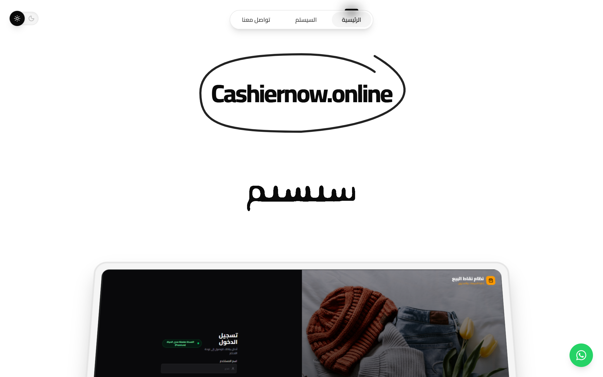

---

## What I Built

- Designed and implemented the CashierNow marketing website and its Arabic-first visual system.
- Engineered root-level RTL behavior with deliberate LTR islands for plan names, prices, charts, and technical content.
- Created responsive product presentation, pricing, contact, navigation, and interactive-demo experiences.
- Built a three-period pricing system from one typed source of truth so rendered prices and purchase-message data remain synchronized.
- Implemented context-aware WhatsApp purchase flows with the selected plan, period, original price, and discounted price.
- Created a seven-area in-browser POS product demonstration using safe dummy data, including cashier, inventory, invoices, customers, suppliers, reports, and settings experiences.
- Added responsive layouts, accessible controls, light/dark theming, transition choreography, and custom visual effects.

The complete production implementation is not distributed here. Small, sanitized, non-production examples are available in [`docs/code-samples/`](docs/code-samples/).

## Languages & Technologies

| Layer | Technology |
|---|---|
| Language | TypeScript |
| Framework | Next.js 16 (App Router) · React 19 |
| Styling | Tailwind CSS 4 |
| Animation | Framer Motion |
| UI primitives | Base UI / shadcn-style component patterns |
| Icons | Lucide |
| Notifications | Sonner |
| Typography | Cairo variable font |

## Screenshots

All screenshots below were captured from the independently deployed production website. The POS demonstration images intentionally show client-side product-demo interfaces populated with dummy data; no production administration system, credentials, browser chrome, or development tooling is shown.

### Landing and product presentation

| | |
|---|---|
|  | 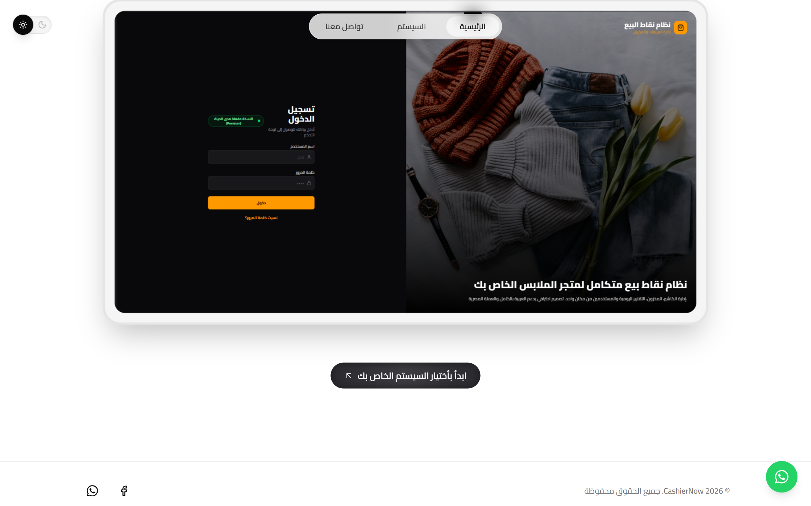 |
| Arabic-first hero and hand-drawn motion language | Scroll-linked product presentation |

### System selection and product demonstration

| | |
|---|---|
| 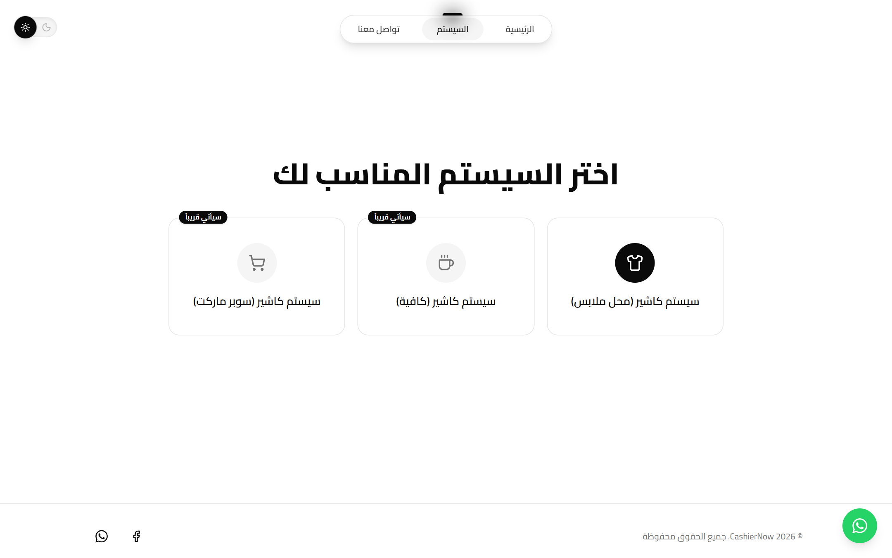 | 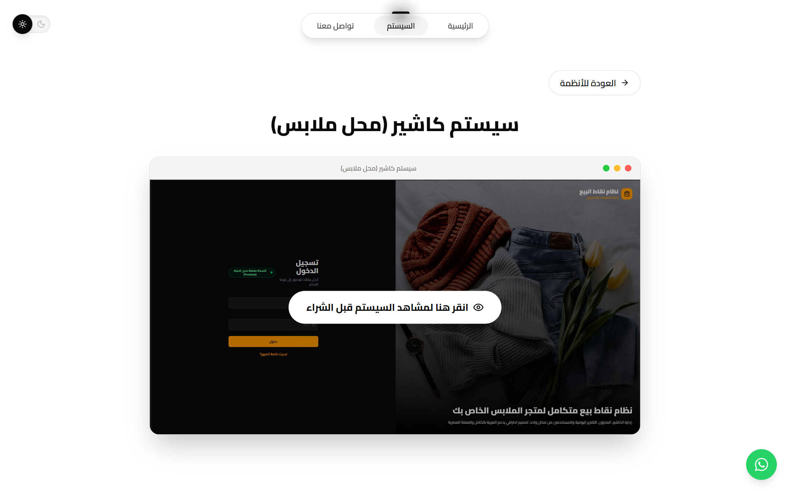 |
| Responsive selection states | Product preview entry point |

### In-browser POS demonstration

| | |
|---|---|
| 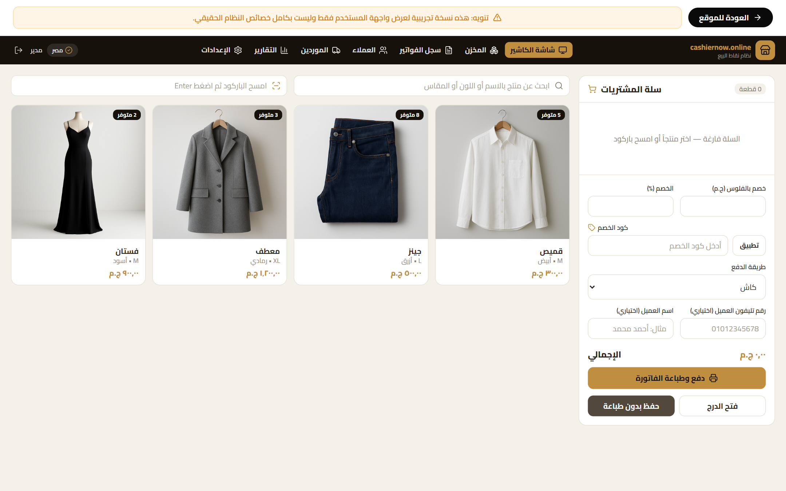 | 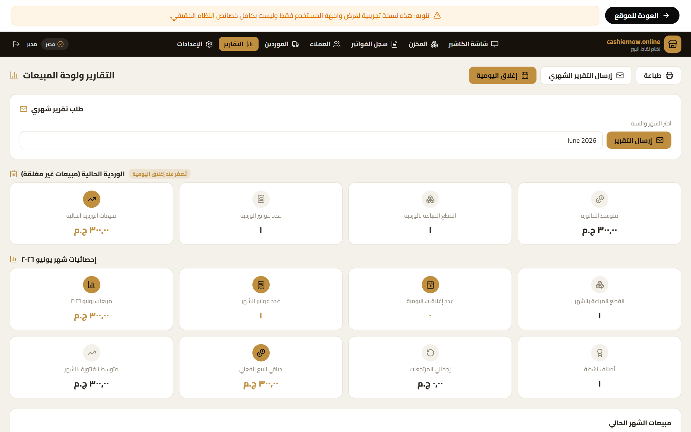 |
| Cashier workflow and cart interaction | Responsive reporting dashboard |

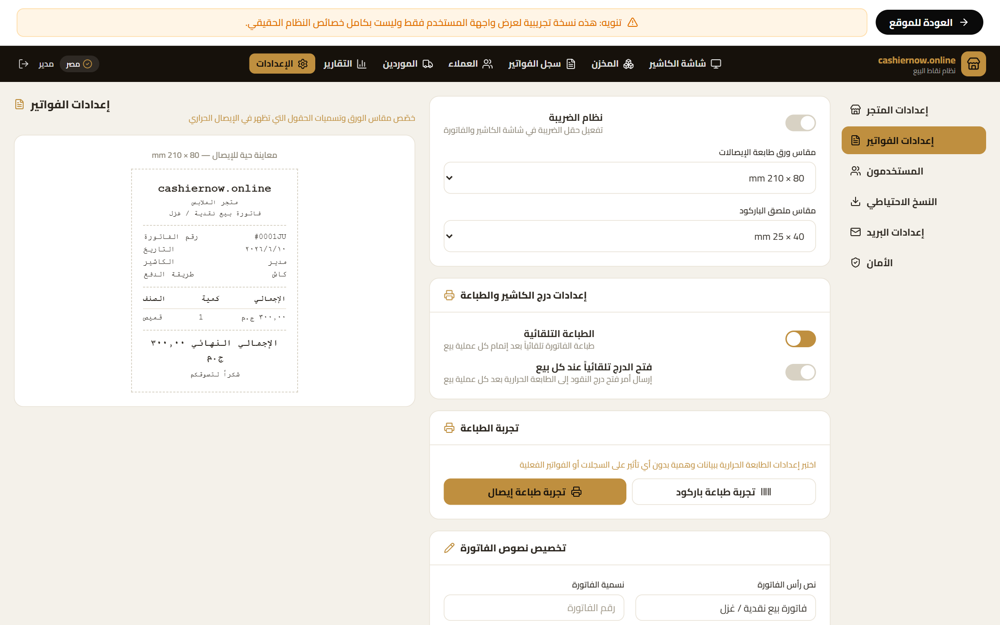

*Receipt configuration and 80mm-preview experience. The proprietary implementation is maintained privately.*

### Pricing and conversion

| Monthly | Three months |
|---|---|
| 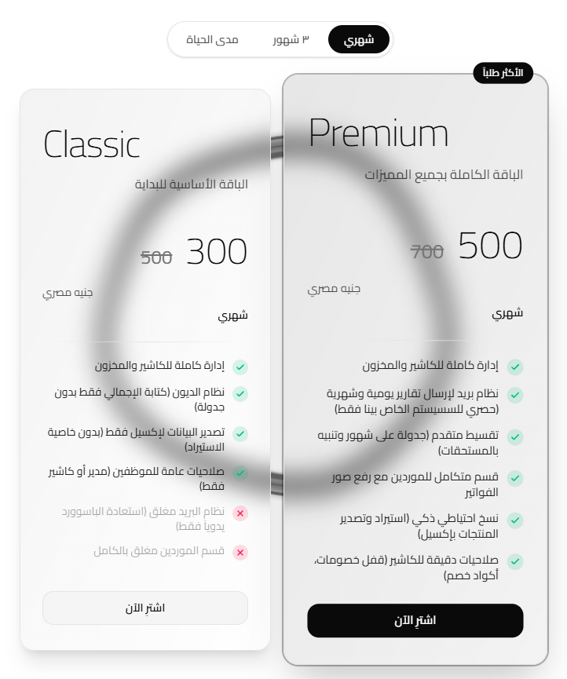 | 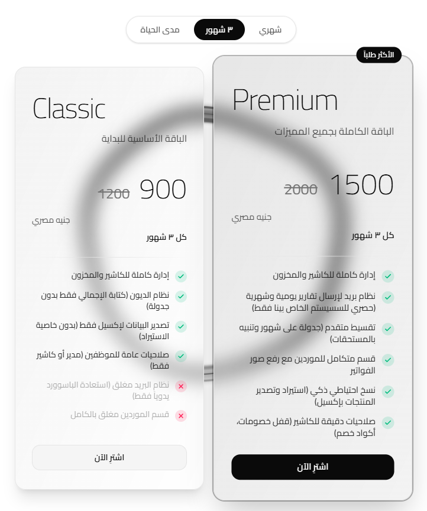 |

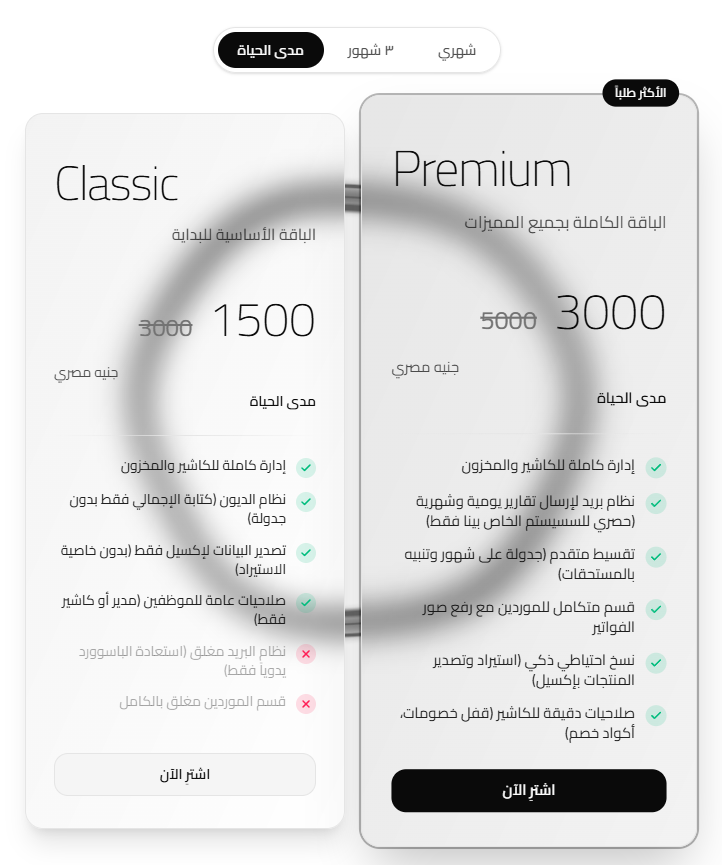

The current pricing architecture uses one typed data model for display values and purchase-message generation:

| Period | Classic | Premium |
|---|---:|---:|
| Monthly | 500 → **300 EGP** | 700 → **500 EGP** |
| 3 Months | 1200 → **900 EGP** | 2000 → **1500 EGP** |
| Lifetime | 3000 → **1500 EGP** | 5000 → **3000 EGP** |

### Dark mode and contact

| | |
|---|---|
| 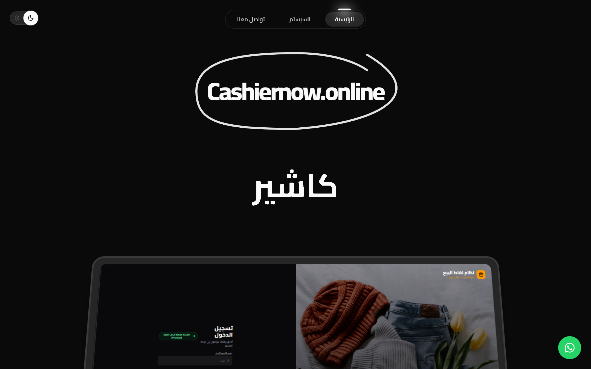 | 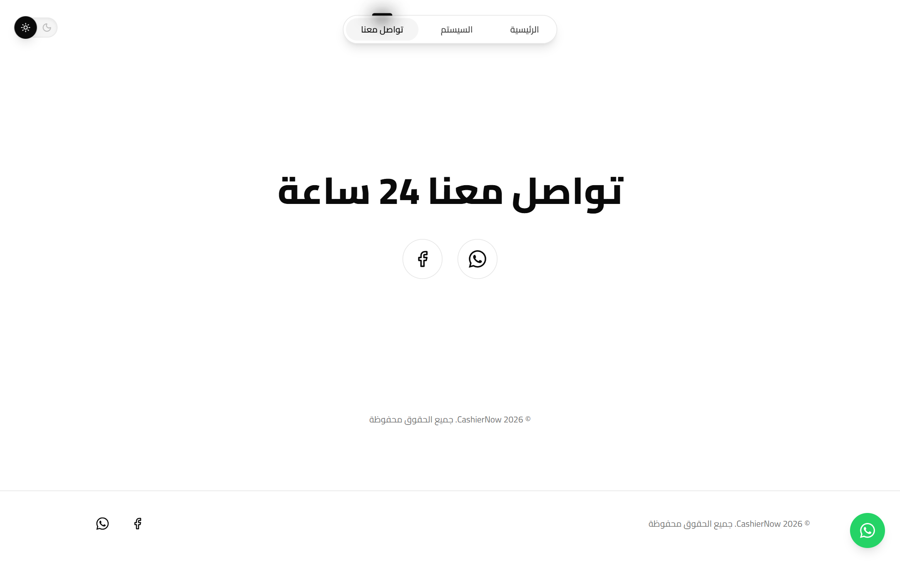 |

## Responsive Design

The same production experience adapts across breakpoints; there is no separate mobile website.

| Desktop (1440px) | Tablet (834px) | Mobile (393px) |
|---|---|---|
|  | 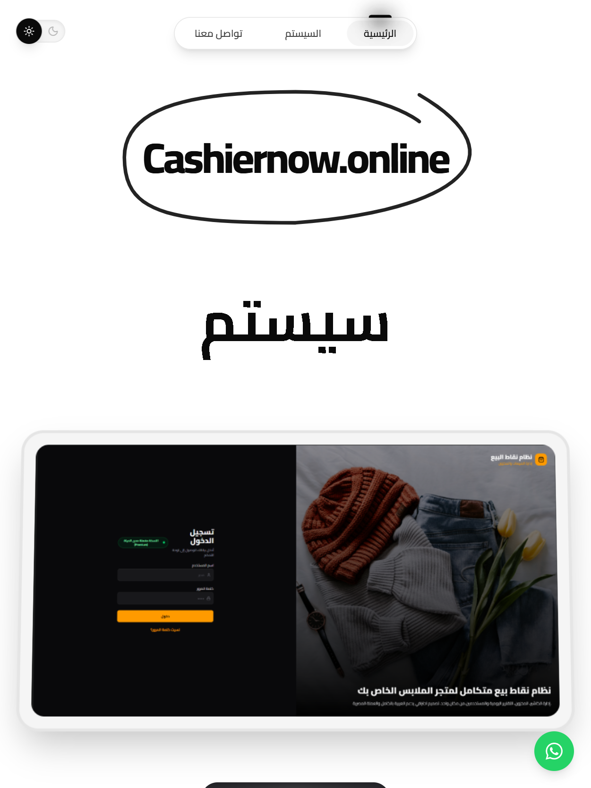 | 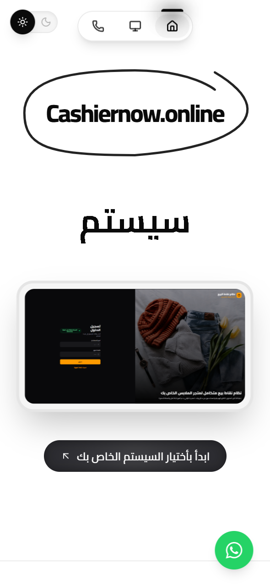 |

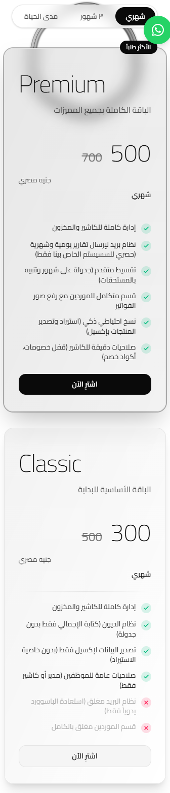

Representative engineering techniques used in the production implementation include:

- responsive Tailwind breakpoints and content-aware stacking;
- compact icon navigation at small widths;
- a mobile horizontal tab model for the POS demonstration;
- resize-aware canvas and scroll-linked motion calculations;
- intentional RTL/LTR boundaries for Arabic content and numerical displays.

## Frontend Engineering Highlights

- **Arabic RTL engineering** — semantic RTL composition, logical ordering, and narrow LTR islands rather than page-wide direction overrides.
- **Component architecture** — reusable cards, controls, stateful selectors, dialogs, and presentation primitives.
- **Single-source pricing** — typed period/plan data drives card values, labels, and generated purchase content.
- **Unicode-safe messaging** — complete Arabic messages are encoded once at the URL boundary.
- **Responsive interaction design** — navigation, cards, tab systems, and demonstration views adapt without duplicating pages.
- **Motion architecture** — shared-layout indicators, enter/exit choreography, scroll transforms, and restrained micro-interactions.
- **Custom visual engineering** — hand-drawn SVG motion, gooey text treatment, theme-aware canvas effects, and perspective product reveals.
- **Accessibility considerations** — tabs, switches, dialogs, icon labels, decorative-element hiding, keyboard focus, and selected-state semantics.
- **Performance awareness** — visibility-aware animation work, responsive image handling, and GPU-friendly transforms.
- **Security awareness** — production uses a nonce-based Content Security Policy and defensive browser headers; deployment details remain private.

## Design System

- **Typography:** Cairo variable font supports Arabic and Latin while maintaining a consistent hierarchy.
- **Color:** a monochrome neutral token system supports light and dark modes; product-demo surfaces use a distinct warm accent hierarchy.
- **Cards:** consistent radii, restrained glass treatment, border emphasis, and featured-plan hierarchy.
- **Spacing:** responsive section rhythm and an 8px-grid sensibility.
- **Buttons:** primary, secondary, purchase, and icon-control levels with complete interaction states.
- **RTL:** logical layout techniques replace fragile absolute-position mirroring.

## UI Interactions

| Interaction | Production technique |
|---|---|
| View transitions | Framer Motion enter/exit choreography |
| Navigation indicator | Shared-layout active state |
| Pricing selector | Sliding selected state and price crossfade |
| Cards | Hover lift, border emphasis, and shadow depth |
| Purchase actions | Context-aware WhatsApp deep links |
| Theme control | Spring motion with semantic switch state |
| Brand treatment | Hand-drawn SVG path animation |
| Hero copy | Gooey morph transition |
| Product presentation | Scroll-linked perspective transform |
| Demo preview | Accessible full-screen dialog behavior |

## Selected Code Samples

Additional decision records: [architecture overview](architecture/README.md) and [design-system notes](design-system/README.md).

The examples in [`docs/code-samples/`](docs/code-samples/) are intentionally simplified portfolio excerpts. They demonstrate engineering patterns—not the production component tree, exact design, assets, effects, or page composition.

- [RTL layout example](docs/code-samples/rtl-layout-example.tsx)
- [Responsive card example](docs/code-samples/responsive-card-example.tsx)
- [Pricing data model](docs/code-samples/pricing-data-model.ts)
- [WhatsApp message builder](docs/code-samples/whatsapp-message-builder.ts)
- [Animation pattern](docs/code-samples/animation-pattern.tsx)
- [Accessible toggle example](docs/code-samples/accessibility-toggle-example.tsx)

## Repository Scope

This is documentation plus selected samples, not a distributable application. A lightweight CI check validates portfolio structure, current pricing statements, and documentation links; it does **not** claim to build the private production website. The repository intentionally excludes:

- complete page composition and production components;
- proprietary visual effects and exact motion implementation;
- the complete POS demonstration;
- product assets required to reproduce the website;
- production backend, hosting, deployment, and operational configuration.

The live website remains the authoritative product experience: **[cashiernow.online](https://cashiernow.online)**.

## Security

See [SECURITY.md](SECURITY.md). This portfolio contains no production credentials, backend, deployment configuration, or private infrastructure details. Please submit security reports privately.

---

> CashierNow branding, visual design, product imagery, and production implementation are proprietary. See [LICENSE.md](LICENSE.md).

© CashierNow / Ahmed Salah. All rights reserved.
